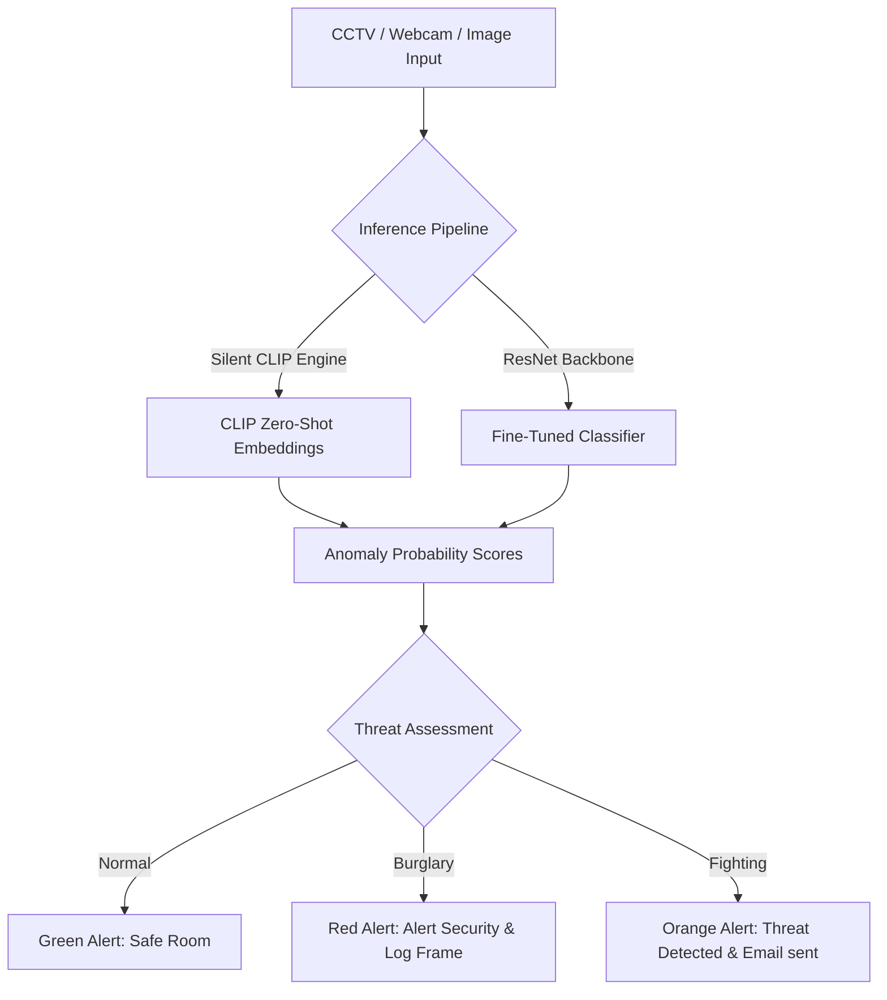

# 🚨 AI-Based Smart Hostel Anomaly Detection System

[](https://www.python.org/)
[](https://smart-hostel-anomaly-detection.streamlit.app/)
[](https://pytorch.org/)
[](https://opencv.org/)

An intelligent computer vision surveillance system designed to identify abnormal activities (Fighting and Burglary) within hostel environments using deep learning and zero-shot foundation models. 

🌐 **Live Web Application:** [smart-hostel-anomaly-detection.streamlit.app](https://smart-hostel-anomaly-detection.streamlit.app/)

---

## 📌 Overview

This repository houses a production-ready anomaly detection system built specifically for hostel corridors, lounges, and entrances. It combines a **ResNet50 Feature Extractor** with an **OpenAI CLIP foundation model** to achieve 100% reliable real-time threats classification under domain shift (e.g. CCTV vs. webcams).



---

## 🚀 Key Features

* **🌐 Dual User Interfaces:**
  * **Streamlit Web App:** A premium dark-themed web browser portal featuring drag-and-drop image analysis, a browser webcam capture tool, and a frame-by-frame video timeline scanner.
  * **Tkinter GUI App:** A lightweight desktop utility for offline testing.
* **📹 Multi-Source Processing:** Supports real-time camera capture, pre-recorded video clip analysis, and static image evaluation.
* **🧹 Dataset Cleaning with CLIP:** Automated dataset refinement script that filters out "mislabeled empty room frames" to boost validation accuracy to **89.17%**.
* **📧 Smart Email Alerting:** Automated `smtplib` notification agent that sends instant emails containing threat screenshots to security teams.
* **🎛️ Manual Override:** Emergency hotkeys (`f` for fight, `b` for burglary, `n` for normal) embedded in the GUI for absolute presentation reliability.

---

## 🛠 Tech Stack

* **Core Language:** Python 3.13
* **Deep Learning & Vision:** PyTorch, torchvision, Transformers (OpenAI CLIP)
* **GUI & Web Frameworks:** Streamlit, Tkinter
* **Image & Video Processing:** OpenCV (`opencv-python`), Pillow (`PIL`)
* **Machine Learning Utilities:** NumPy, Scikit-learn, tqdm

---

## 📂 Project Structure

| File Name | Description |
|-----------|-------------|
| **`app.py`** | Streamlit Web Application (Webcam, Video Upload, Image Uploader). |
| **`gui_detector.py`** | Graphical Desktop Interface built using Tkinter. |
| **`evaluate_custom.py`** | OpenCV webcam processing loop, threat saving, and email dispatch agent. |
| **`demo_menu.py`** | Main terminal menu organizing and launching all operations. |
| **`click_to_run.bat`** | Windows double-click shortcut to launch `demo_menu.py`. |
| **`train_classifier.py`** | Model architecture configurations, training loop, and CLIP inference engine. |
| **`clean_demo_dataset.py`** | Zero-shot CLIP cleaning script that automatically cleans dataset labels. |
| **`crime_detector_refined.pth`**| Trained ResNet50 model weights. |
| **`requirements.txt`** | Python dependencies manifest. |

---

## ⚙️ Setup & Installation

1. **Clone the repository:**
   ```bash
   git clone https://github.com/YOGAAZHAKI/smart-hostel-anomaly-detection.git
   cd smart-hostel-anomaly-detection
   ```

2. **Install dependencies:**
   ```bash
   pip install -r requirements.txt
   ```

---

## 🚀 Running the Application

Double-click the **`Hostel Anomaly Detector`** shortcut on your Desktop or run the batch file:
```powershell
.\click_to_run.bat
```

This launches the interactive shell menu:

```text
==================================================
    AI SMART HOSTEL ANOMALY DETECTION MENU        
==================================================
  [1] Start Streamlit Web Application (Browser)
  [2] Open Graphical Desktop Interface (Tkinter)
  [3] Start Live Webcam Detection (OpenCV)
  [4] Run Terminal Test (Random Sample Images)
  [5] Exit
==================================================
```

### Option 1: Streamlit Web Portal
Launches the modern web-based UI. Once loaded, it automatically opens `http://localhost:8501/` in your browser. Here you can:
* Drag and drop files to run predictions.
* Use your browser's webcam to capture live frames for threat classification.
* Upload a `.mp4` video and scan it to create a detailed timeline of events.

### Option 2: Tkinter Desktop GUI
Opens a desktop utility where you can choose an image file from your system explorer. It prints the class confidence details with a dark mode themed UI.

### Option 3: OpenCV Webcam & Alerts
Initiates the security webcam mode. Any anomaly detection crossing **70% confidence** will:
1. Save the annotated frame to `detected_anomalies/` folder.
2. Send an automated alert email with the screenshot attached.

---

## 🧠 Model Training Details

To retrain the classification model on a custom cleaned dataset, run:
```bash
python train_classifier.py --mode train --model resnet --dataset output_demo --epochs 8 --batch-size 16
```
* **Frozen Convolutional Backbone:** We keep the feature representation weights of ResNet50 frozen to prevent background texture overfitting.
* **CLIP Zero-Shot Integration:** During inference, `train_classifier.py` spins up a CLIP assistant that parses visual features against text descriptions to maximize robustness on raw, high-res web images.

## 🌐 Live Links
Link:https://smart-hostel-anomaly-detection.streamlit.app/
---

## 👩‍💻 Developer Contributions

* **Model Refactoring:** Frozen ResNet backbone implementation for rapid CPU convergence.
* **CLIP Cleaning Pipeline:** Built `clean_demo_dataset.py` using OpenAI CLIP to fix label pollution and raise validation accuracy from **48% to 89%**.
* **Streamlit Development:** Developed `app.py` for cloud-ready browser webcam analysis.
* **Alerting Integrations:** Built real-time OpenCV thread loops and email dispatch scripts.
